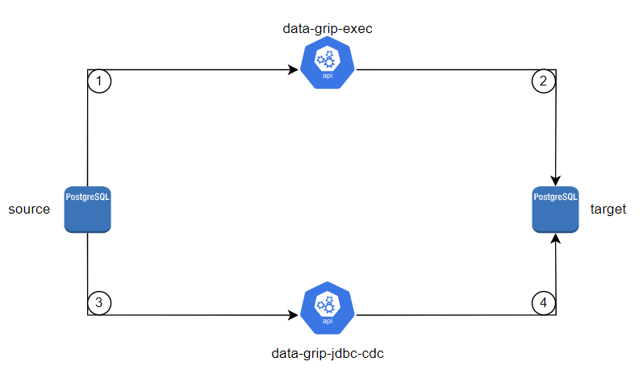
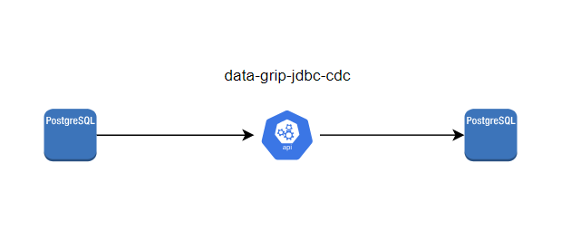
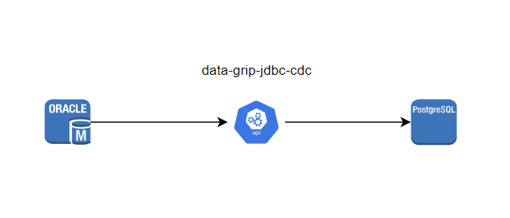

# DataGrip

#### [DataGrip 中文](README_zh.md)

"DataGrip is an open-source program that can export DDL statements such as table creation commands, views, indexes, and sequence for Mysql, Postgres, and Oracle. 
It will also support database schema conversion and data synchronization in the future, and we hope everyone can participate."


# Project structure

```

├───data-grip-core-starter  核心处理公共包
├───data-grip-exec          数据库表结构的生成
├───data-grip-flink-cdc     待开发
├───data-grip-jdbc-cdc      数据同步组件
└───doc                     相关文档               

```


# Practical exercise



- Generate source construction statements, SEQ, view, function and other statements to the project path through `data-grip-exec`
- Import the generated DDL statement into the target database on demand
- Use `data-grip-jdbc-cdc` to synchronize all the source data to the target database, and support the exclusion of tables that do not need to be synchronized


# Implementation Model Translation

## postgres to postgres



Data Transfer through the Following Interfaces Translation
```
### 同步建表语句
GET http://localhost:8080/datagrip/api/gen/pg

### 同步数据
GET http://localhost:8081/jdbc/cdc/pg/sync
```


## oracle to postgres



Data Transfer through the Following Interfaces Translation
```
### orlace 同步 pgsql
GET http://localhost:8081/jdbc/cdc/ora/pg/sync
```

Currently, Oracle and PostgreSQL only support the synchronization of table structure and data, and do not support the migration of functions.